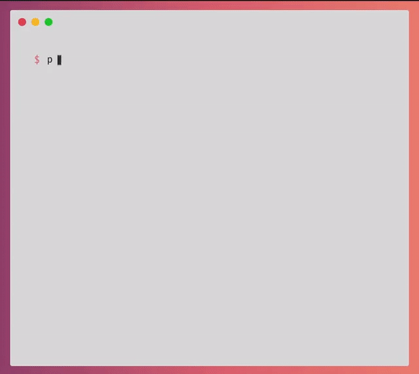

<p align="center">
  
  
</p>

<br>

# ⚡️ Real-time inference for Stable Diffusion
<!--  -->

<p align="center">
 
</p>

Stochastic provides this repository to perform fast real-time inference with `Stable Diffusion`. The goal of this repo is to collect and document as many optimization techniques for Stable Diffusion as possible. 

Currently this repository includes 4 optimization techiques with more in the pipeline. Feel free to open a PR to submit a new optimization technique to the folder.

<!-- TOC -->
Table of contents:
- [Optimizations](#-optimizations)
- [Benchmarks](#benchmark-result)
- [Deploy](#deployment)
    - [Quickstart](#-quickstart)
    - [Manual](#manual)
- [Stochastic](#-stochastic)
    - [Features](#features)
- [Reference](#reference)
<!-- /TOC -->

## 🔥 Optimizations

- AITemplate: [Latest optimization framework of Meta](https://github.com/facebookincubator/AITemplate)
- TensorRT: [NVIDIA TensorRT framework](https://github.com/NVIDIA/TensorRT)
- nvFuser: [nvFuser with Pytorch](https://pytorch.org/blog/introducing-nvfuser-a-deep-learning-compiler-for-pytorch/)
- FlashAttention: [FlashAttention intergration in Xformers](https://github.com/facebookresearch/xformers)

## Benchmark result

Here are some benchmark results on 1x40GB A100 gpu, cuda11.6:

All benchmarks are doing by averaging 50 iterations run:
```
Running args {'max_seq_length': 64, 'num_inference_steps':50, 'image_size':(512,512)}
```
Throughput in sec on 1x40GB A100 gpu - batch size = 1:

| project                | Latency (s) | GPU VRAM (GB) |
| :--------------------- | :---------- | :------------ |
| PyTorch           fp16 |  5.77       |  10.3         |
| nvFuser           fp16 |  3.15       |  ---          |
| FlashAttention    fp16 |  2.80       |  7.5          |
| TensorRT          fp16 |  1.68       |  8.1          |
| AITemplate        fp16 |  1.38       |  4.83         |

## Batched Version

Result on different batch size:
```
Running args {'max_seq_length': 64, 'num_inference_steps':50, 'image_size':(512,512)}
```

| project           \ bs |      1        |     4         |    8          |    16             |   24              | 
| :--------------------- | :------------ | :------------ | :------------ | :---------------- | :---------------- |
| Pytorch           fp16 | 5.77s/10.3GB  | 19.2s/18.5GB  | 36s/26.7GB    |  OOM              |                   |
| FlashAttention    fp16 | 2.80s/7.5GB   |  9.1s/17GB    | 17.7s/29.5GB  |  OOM              |                   |
| TensorRT          fp16 | 1.68s/8.1GB   |  OOM          |               |                   |                   |
| AITemplate        fp16 | 1.38s/4.83GB  | 4.25s/8.5GB   | 7.4s/14.5GB   |  15.7s/25GB       |  23.4s/36GB       |

> Note: TensorRT is out of memory in the covertion stage which convert Unet model from Onnx to TensorRT.

## 🚀 Quickstart

Make sure you have [Python](https://www.python.org/downloads/) and [Docker](https://docs.docker.com/engine/install/) installed on your system

1. Install the latest version of `stochasticx` library.
```
pip install stochasticx
```

2. Deploy the Stable Diffusion model
```
stochasticx stable-diffusion deploy --type aitemplate
```

If you don't have a Stochastic account, then the CLI will prompt you to quickly create one. It is free and just takes 1 minute [Sign up →](https://app.stochastic.ai/signup)

> Alternatively, you can deploy stable diffusion without our CLI by checking the steps [here](#manual-deployment).


To infer with this deployed model:
```
stochasticx stable-diffusion infer --prompt "Riding a horse"
```
 Check all the options of the `infer` command:
```
stochasticx stable-diffusion infer --help
```


You can get the logs of the deployment executing the following command:
```
stochasticx stable-diffusion logs
```

Stop and remove the deployment with this command:
```
stochasticx stable-diffusion stop
```

## Manual deployment

Check the `README.md` of the following directories:
- AITemplate
- FlashAttention
- nvFuser
- PyTorch
- TensorRT 

## ✅ Stochastic

Stochastic was founded with a vision to make deep learning optimization and deployment effortless. We make it easy to ship state-of-the-art AI models with production-grade performance.

### Features
- Auto-optimization of deep learning models
- Benchmarking of models and hardware on different evaluation metrics
- Auto-scaling hosted and on-prem accelerated inference for models like BLOOM 176B, Stable Diffusion, GPT-J [Enquire →](https://stochastic.ai/contact)
- Support for AWS, GCP, Azure clouds and Kubernetes clusters

### [Sign up →](https://www.stochastic.ai/)


## Reference

- [HuggingFace Diffusers](https://github.com/huggingface/diffusers)
- [AITemplate](https://github.com/facebookincubator/AITemplate)
- [Make stable diffusion up to 100% faster with Memory Efficient Attention](https://www.photoroom.com/tech/stable-diffusion-100-percent-faster-with-memory-efficient-attention/)
- [Making stable diffusion 25% faster using TensorRT](https://www.photoroom.com/tech/stable-diffusion-25-percent-faster-and-save-seconds/)
